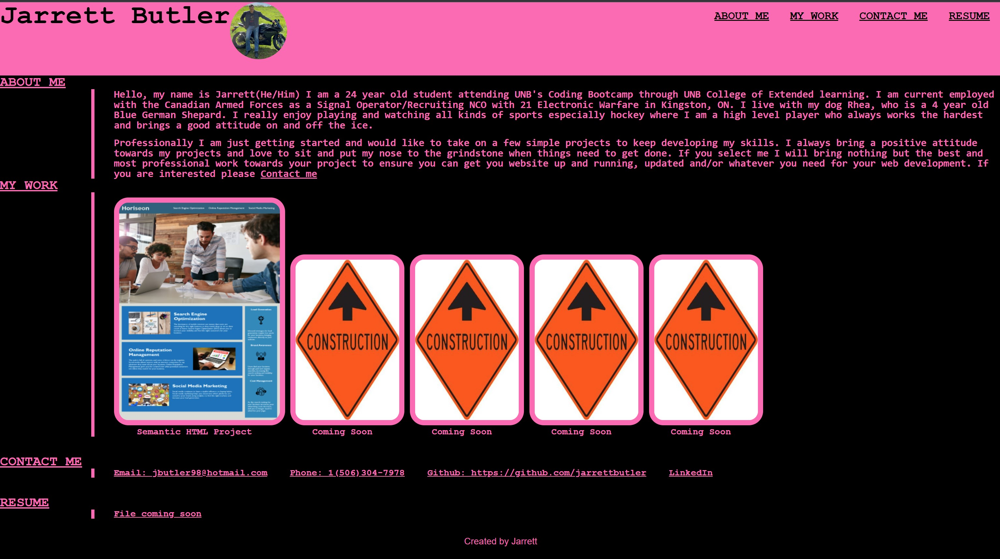

# Portfolio

## Description

This website is my beginner portfolio to show off my development skills to potential employers or cutomers. It is very important to have a good portofilio as it is the first impression you put on a potential client. 9/10 they will probably decide if they will hire you or not based off the portfolio. This is something very basic that I can use going forward with my career but also easy enough that it can be done on the second week. The thing I leanrt about the most is that CSS can be a huge pain and it is very maticulous. 

## Installation

Please either clone or run my HTML document or copy and paste the following link to open:

https://jarrettbutler.github.io/Challenge02/

https://github.com/jarrettbutler/Challenge02

## Usage

This is just a simple webpage that allows me to show off my skills. There isn't anything too fancy but if you click on one of the options in the top right corner it will take you down to that section. As well if you click on any of the links/images they will direct you to that project.

## License

Please see git repo for the license

## Features

Most of the site is interactive if you click on most of the links it will take you to that page/do what it says

## Tests

***PLEASE PLEASE PLEASE CLICK ON THE UNDER CONSTRUCTION IMAGE***
As well if you click on my email in the contact me it will direct you to you prefered email in order for you to send me an email